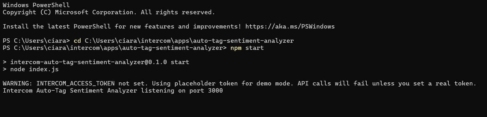
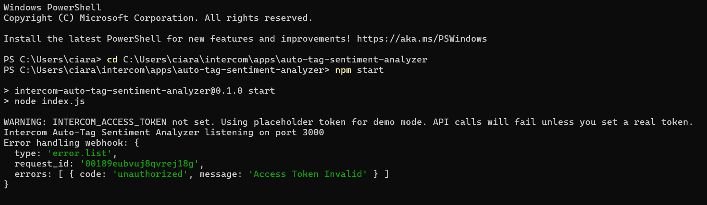

# Intercom Auto-Tag Sentiment Analyzer

Automatically tags Intercom users as `positive` or `negative` based on sentiment analysis of their first conversation message.

---

## Trac Address (for payouts)

trac1yxj0dk9w8wvjc3pw279xrkaettq5tpyy55f0zqhhhp4psruakf0qeqs007

---

## Proof of Running

**Service startup (demo mode):**



**Webhook handling (demo token – expected authorization error):**



> Note: When `INTERCOM_ACCESS_TOKEN` is not set, the app runs in demo mode.  
> Webhook requests are received and processed, but Intercom API calls correctly fail with `unauthorized`.

---

## How It Works

- Listens for Intercom webhook events: `conversation.user.created`
- Extracts the first conversation message
- Analyzes sentiment using the `sentiment` npm package
- Determines a `positive` or `negative` label
- Attempts to apply the corresponding tag via the Intercom REST API
- Runs fully in demo mode without credentials for local verification

---

## Configuration

Environment variables:

```env
INTERCOM_ACCESS_TOKEN=your_intercom_access_token
PORT=3000
