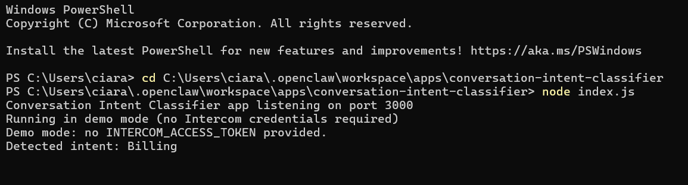
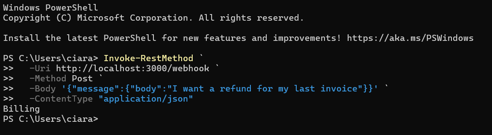

# Conversation Intent Classifier

Assigns one intent label to a new conversation using deterministic keyword rules.

## Trac Address (for payouts)

trac1lmecylkpa2vdpt87ql5ucwzp6rcatsrx0cjasnuqyyy4qqyezcqqv3lr2z

## Summary

Labels the customer’s first message with exactly one intent from a fixed set: Billing, Bug, Feature, Cancellation, How-To, Other.

## How it works

Receives a conversation payload in demo mode (no credentials required)  
Extracts the customer message text  
Matches against fixed keyword lists (case-insensitive, first match wins)  
Returns a single label string

## Intercom integration

Designed for “conversation created” style inputs (first customer message text)  
Does not call Intercom APIs in demo mode  
Produces one label that can be used by downstream routing or tagging systems

## Proof

**Server startup**

**Request response**

